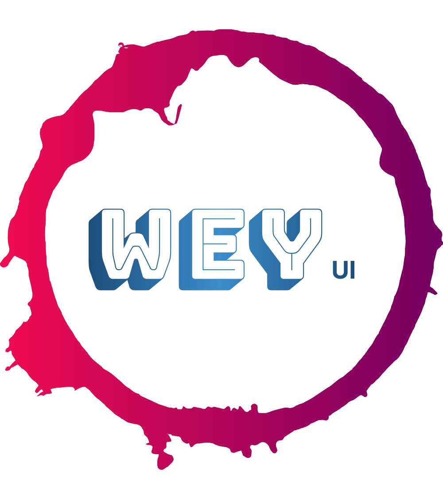

# WeyUI

[](LICENSE)
[](https://github.com/yaoyaochil/WeyUI/stargazers)
[](https://github.com/yaoyaochil/WeyUI/issues)
[](https://github.com/yaoyaochil/WeyUI/network)
[](https://yaoyaochil.github.io/WeyUI/)


## 项目简介

WeyUI 是一个使用 Vite、Vue 3、Arco.Design UI 和 TypeScript 开发的项目，旨在为微信平台开发提供各种组件，使开发更加便捷。

## 项目文档
[在线文档](https://yaoyaochil.github.io/WeyUI/) : https://yaoyaochil.github.io/WeyUI/


## 特点

- 使用 Vue 3 的 Composition API 构建
- 基于 TypeScript，提供类型安全
- 快速开发，使用 Vite 构建工具
- 针对微信公众号、企业微信、微信小程序后台管理组件的特定需求定制

## 安装

你可以通过以下命令安装 WeyUI：

```bash
npm install @yaoyaochi/weyui@latest --save
```

## 使用
- 后续会提供更多组件的使用方法集中于文档站点 目前独立开发中 精力有限
- 如有兴趣加入 请联系我


## 相关产品推荐
- [PowerX 一款以企业微信为基础的微信私域运营开放平台，帮助企业实现引流获客、精细运营。](https://github.com/ArtisanCloud/PowerX)
- [PowerWechat 一款基于WeChat SDK for Golang，支持小程序、微信支付、企业微信、公众号等全微信生态](https://github.com/ArtisanCloud/PowerWeChat)

## 常见问题
- 如遇见声明类型问题 请在vite-env.d.ts中添加声明
```typescript
declare module '@yaoyaochi/weyui'
```

## 贡献
如果你想为 WeyUI 贡献代码或报告问题，请查看我们的 贡献指南。


如果感觉对你有帮助，欢迎点个star，谢谢！或者可以赞助我一杯咖啡


| 赞助者 | 金额 |
|-----|----|
|     |    |
|     |    |
|     |    |


## 许可证
这个项目使用 [Apache-2.0](./LICENSE) 许可证。

## 作者
- 作者名字：[Tim Wang](https://github.com/yaoyaochil)
- 邮箱：wangrui19970405@gmail.com
- 更多信息
- 项目链接：[GitHub](https://github.com/yaoyaochil/WeyUI)
- 问题和反馈：[GitHub Issues](https://github.com/yaoyaochil/WeyUI/issues)