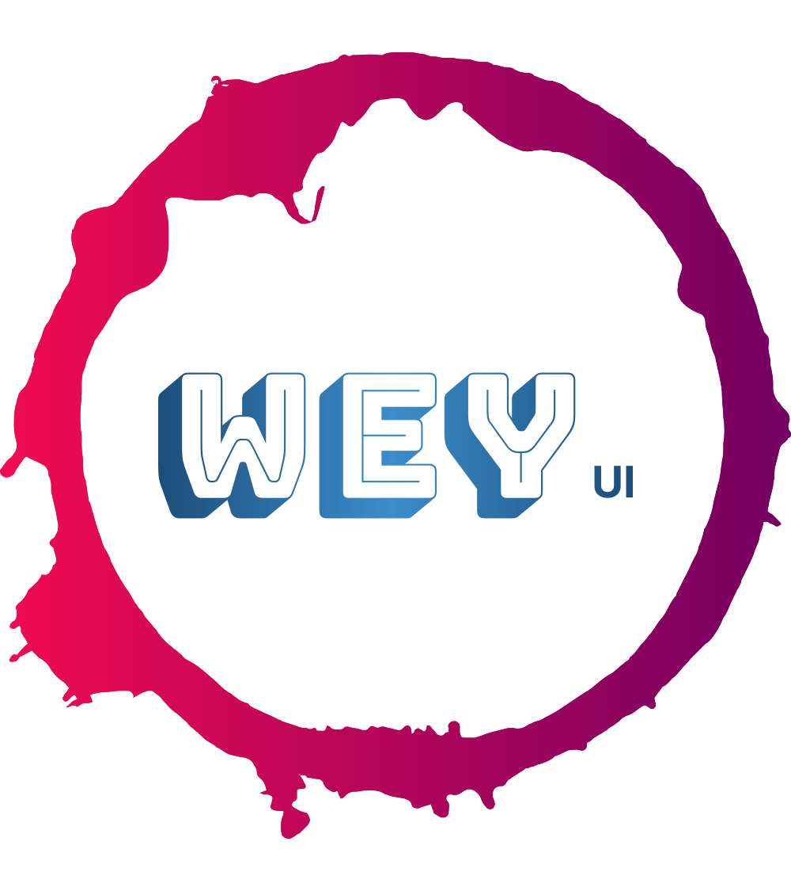

# WeyUI

[](LICENSE)
[](https://github.com/yaoyaochil/WeyUI/stargazers)
[](https://github.com/yaoyaochil/WeyUI/issues)
[](https://github.com/yaoyaochil/WeyUI/network)


## 项目简介

WeyUI 是一个使用 Vite、Vue 3、Arco.Design UI 和 TypeScript 开发的项目，旨在为微信平台开发提供各种组件，使开发更加便捷。

## 特点

- 使用 Vue 3 的 Composition API 构建
- 基于 TypeScript，提供类型安全
- 快速开发，使用 Vite 构建工具
- 针对微信公众号、企业微信、微信小程序后台管理组件的特定需求定制

## 安装

你可以通过以下命令安装 WeyUI：

```bash
npm install @yaoyaochi/weyui
```

## 使用
- 后续会提供更多组件的使用方法集中于文档站点 目前独立开发中 精力有限
- 如有兴趣加入 请联系我


#### 自定义菜单
```vue
<template>
  <w-offi-account-menu :isRemote="true" :menuData="menu_data_list" @submitData="getMenu"></w-offi-account-menu></template>
  <woffi-account-media
    @on-down-load="downLoadImage"
    @on-delete="deleteImg"
    @page-change="pageChange"
    @page-size-change="pageSizeChange"
    @onChangeTab="onChangeTab"
    @onPreview="onPreview"
    action="/api/wechat/media/uploadOtherMedia"
    :media-data="mediaData"
    :total="total"
    :current="current"
    :page-size="pageSize"
    :page-size-options="[10, 20, 30, 50,100]"
    :tem-url="temUrl"
  />
<script setup lang="ts">
import { ref } from 'vue'
import { WOffiAccountMenu } from '@yaoyaochi/weyui'
import '@yaoyaochi/weyui/style.css'
const subMenuData = async(menuData: any)=>{
  console.log(menuData)
}
const menu_data_list = ref({
  button: [],
  matchrule: {}
} as Record<any, any>)
</script>
```

#### 素材管理
```vue
<template>
  <woffi-account-media
    @on-down-load="downLoadImage"
    @on-delete="deleteImg"
    @page-change="pageChange"
    @page-size-change="pageSizeChange"
    @onChangeTab="onChangeTab"
    @onPreview="onPreview"
    action="/api/wechat/media/uploadOtherMedia"
    :media-data="mediaData"
    :total="total"
    :current="current"
    :page-size="pageSize"
    :page-size-options="[10, 20, 30, 50,100]"
    :tem-url="temUrl"
  />
</template>
<script setup lang="ts">
import {ref} from 'vue'
import {getMedia, getMediaOtherList} from './api/api'

const total =ref(0) // 总条数
const pageSize = ref(10) // 每页条数
const current = ref(1) // 当前页码
const dataType = ref('image') // 素材类型

const mediaData = ref({} as any) // 素材数据
const temUrl = ref('') // 临时url

const getMediaData = async (type:string) => { // 获取素材列表
  mediaData.value = {}
  total.value = 0
  // 模拟分页数据 按照每页10条数据
  const res = await getMediaOtherList(type)
  mediaData.value = res
  mediaData.value.item = res.item.slice(0, 10)
  total.value = res.total_count
}

const getMediaById = async (media_id:string,type:string) => { // 获取素材
  const res:any = await getMedia({media_id: media_id,type: type})
  if (res.data && type === 'video' || type === 'news') {
    temUrl.value = res.data.data.down_url
    return
  }
  if (res.data) {
    temUrl.value = URL.createObjectURL(res.data)
    return
  }
}

getMediaData('image')

const onChangeTab = async (item: any) => { // 切换tab
  dataType.value = item
  await getMediaData(item)
  console.log(dataType.value)
}
const downLoadImage = (item: any) => { // 获取图片URL
  console.log(item)
}

const deleteImg = (item: any) => { // 删除图片
  console.log(item)
}

const pageChange = async (page: number) => { // 页码改变 建议offset = (page - 1) * pageSize
  current.value = page
  if (current.value === 1) {
    const res = await getMediaOtherList(dataType.value)
    mediaData.value.item = res.item.slice(0, 10)
  }
  if (current.value === 2) {
    const res = await getMediaOtherList(dataType.value)
    mediaData.value.item = res.item.slice(10, 20)
  }
}

const pageSizeChange = async (size: number) => { // 每页条数改变
  pageSize.value = size
  if (pageSize.value === 10) {
    mediaData.value.item = []
    const res = await getMediaOtherList(dataType.value)
    mediaData.value.item = res.item.slice(0, 10)
  }
  if (pageSize.value >= 20) {
    const res = await getMediaOtherList(dataType.value)
    mediaData.value.item = res.item.slice(0, 20)
  }
}

const onPreview = async (media_id: string,type:string) => { // 预览素材 仅用于语音 视频'
  console.log(media_id,type)
  await getMediaById(media_id,type)
}
</script>
```

## 相关产品推荐
- [PowerX 一款以企业微信为基础的微信私域运营开放平台，帮助企业实现引流获客、精细运营。](https://github.com/ArtisanCloud/PowerX)
- [PowerWechat 一款基于WeChat SDK for Golang，支持小程序、微信支付、企业微信、公众号等全微信生态](https://github.com/ArtisanCloud/PowerWeChat)

## 常见问题
- 如遇见声明类型问题 请在vite-env.d.ts中添加声明
```typescript
declare module '@yaoyaochi/weyui'
```

## 贡献
如果你想为 WeyUI 贡献代码或报告问题，请查看我们的 贡献指南。


如果感觉对你有帮助，欢迎点个star，谢谢！或者可以赞助我一杯咖啡


| 赞助者 | 金额 |
|-----|----|
|     |    |
|     |    |
|     |    |


## 许可证
这个项目使用 MIT 许可证。

## 作者
- 作者名字：[Tim Wang](https://github.com/yaoyaochil)
- 邮箱：wangrui19970405@gmail.com
- 更多信息
- 项目链接：[GitHub](https://github.com/yaoyaochil/WeyUI)
- 问题和反馈：[GitHub Issues](https://github.com/yaoyaochil/WeyUI/issues)
